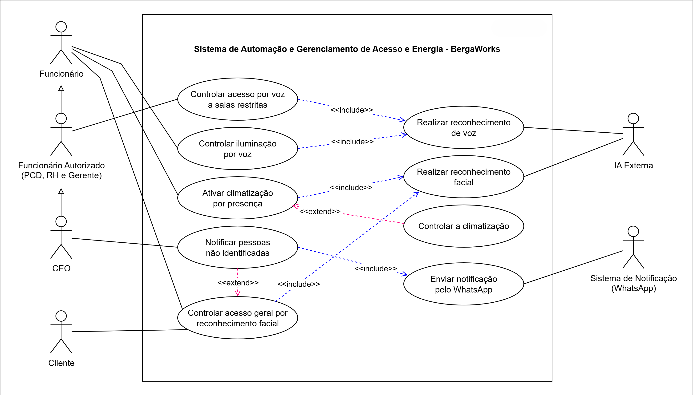
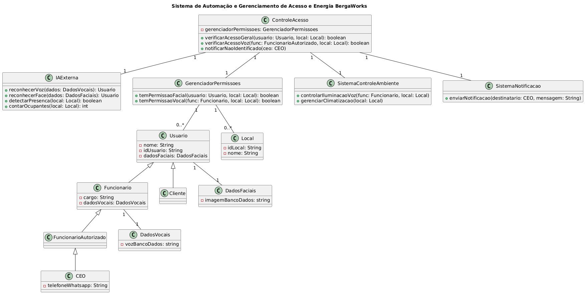

# BergaWorks - Sistema de Controle de Acesso Inteligente | Smart Office Access Control System

Análise e modelagem de sistemas de segurança e automação corporativa utilizando engenharia de requisitos e modelagem UML.

*A system analysis and modeling project for corporate security and automation, leveraging requirements engineering and UML modeling.*

---

## Visão Geral do Projeto / Project Overview

**PT:** Este projeto foi desenvolvido em agosto de 2025 como parte da disciplina de Análise de Sistemas. O foco está no planejamento, engenharia de requisitos e arquitetura de um sistema de controle de acesso de alta segurança para escritórios inteligentes (BergaWorks). O sistema integra inteligência artificial externa para reconhecimento de voz e facial, gerenciando áreas restritas, iluminação automatizada e climatização com base em presença e hierarquia de usuários.

**EN:** This project was developed in August 2025 as part of the System Analysis course. It focuses on the planning, requirements engineering, and architectural design of a high-security smart office access control system (BergaWorks). The system integrates external artificial intelligence (AI) for voice and facial recognition to manage restricted areas, automated lighting, and HVAC systems based on presence and user hierarchy.

---

## Metodologia de Análise / Analysis Methodology

**PT:** Extração de Requisitos via Transcrição: Para garantir a precisão total dos dados e evitar a perda de informações críticas, realizei a transcrição detalhada da entrevista com o cliente. Esse processo foi fundamental para mapear as necessidades reais e convertê-las em especificações técnicas sem erros.

**EN:** Requirements Extraction via Transcription: To ensure full data accuracy and prevent the loss of critical information, a detailed transcription of the client interview was performed. This process was essential to map real needs and convert them into error-free technical specifications.

---

## Engenharia de Requisitos / Requirements Engineering

### Requisitos Funcionais (RF) / Functional Requirements (FR)

- RF01: Controle de Acesso por Comando de Voz a Salas Restritas / Voice Command Access Control for Restricted Rooms:
  - **PT:** O sistema deve utilizar uma IA externa para analisar a voz do locutor e liberar o acesso a salas restritas, permitindo apenas usuários previamente autorizados: CEO, gerente, funcionária PCD do RH e demais funcionários do RH.
  - **EN:** The system must use an external AI to analyze the speaker's voice and grant access to restricted rooms, allowing only previously authorized users: CEO, manager, HR employee with disabilities (PCD), and other HR staff.

- RF02: Controle de Iluminação por Voz / Voice-Controlled Lighting:

  - **PT:** O sistema deve processar comandos de voz para ligar e desligar as luzes nos diversos ambientes do escritório. A ação será executada somente após a IA Externa identificar que a voz pertence a um funcionário com permissão para estar naquele local.
  - **EN:** The system must process voice commands to turn lights on and off in various office environments. The action will be executed only after the external AI identifies that the voice belongs to an employee with permission to be in that location.

- RF03: Ativação da Climatização por Presença / HVAC Activation by Presence:
  - **PT:** O sistema deve ativar ou desativar automaticamente o ar-condicionado dos ambientes com base na detecção de presença de funcionários, identificados através das câmeras pela IA externa, visando a economia de energia.
  - **EN:** The system must automatically activate or deactivate the air conditioning in the environments based on the detection of employee presence, identified through cameras by the external AI, aiming for energy savings.

- RF04: Controle Inteligente da Climatização / Intelligent HVAC Control:
  - **PT:** Uma vez ativado pela presença de pessoas (conforme RF03), o sistema deve controlar e manter a temperatura do ambiente de acordo com a quantidade de ocupantes na sala, com a mínima de 21°C e máxima de 24°C e umidade do ar entre 40% e 60%, visando o conforto térmico e a eficiência de energia.
  - **EN:** Once activated by human presence (as per RF03), the system must control and maintain the room temperature according to the number of occupants, with a minimum of 21°C and a maximum of 24°C, and air humidity between 40% and 60%, aiming for thermal comfort and energy efficiency.

- RF05: Notificação de Pessoas Não Identificadas / Notification of Unidentified Persons:
  - **PT:** Caso as câmeras na entrada do escritório identifiquem a presença de uma pessoa que não foi reconhecida como funcionário ou cliente pelo RF06, a IA externa deve enviar uma notificação (via WhatsApp) para a CEO.
  - **EN:** If the entrance cameras identify the presence of a person who has not been recognized as an employee or client by RF06, the external AI must send a notification (via WhatsApp) to the CEO.

- RF06: Controle de Acesso Geral por Reconhecimento Facial / General Access Control by Facial Recognition:
  - **PT:** O sistema deve realizar reconhecimento facial, usando a IA externa, para comparar com os usuários registrados no banco de dados. Caso seja um funcionário, liberar o acesso à porta de entrada, áreas comuns e sua respectiva sala de trabalho, a menos que esta exija a verificação adicional do RF01. Caso seja um cliente cadastrado, liberar o acesso apenas à porta de entrada do estabelecimento.
  - **EN:** The system must perform facial recognition, using external AI, to compare with users registered in the database. If it is an employee, release access to the entrance door, common areas, and their respective work room, unless it requires additional verification from RF01. If it is a registered client, release access only to the entrance door of the establishment.

### Requisitos Não Funcionais (RNF) / Non-Functional Requirements (NFR)

- RNF01: Segurança da Arquitetura / Architecture Security:
  - **PT:** O sistema utilizará um servidor local para gerenciamento e orquestração. Dados sensíveis armazenados permanentemente neste servidor (como cadastro de usuários e logs) devem ser criptografados em repouso com o padrão AES-256. Toda a comunicação entre o sistema local e os serviços externos de IA, assim como o acesso administrativo web, deve ser protegida por canais criptografados de ponta a ponta, utilizando o protocolo TLS 1.3. O provedor do serviço de IA deve ser aderente à Lei Geral de Proteção de Dados (LGPD).
  - **EN:** The system will use a local server for management and orchestration. Sensitive data permanently stored on this server (such as user registration and logs) must be encrypted at rest with the AES-256 standard. All communication between the local system and external AI services, as well as administrative web access, must be protected by end-to-end encrypted channels using the TLS 1.3 protocol. The AI service provider must comply with the General Data Protection Law (LGPD).

- RNF02: Latência de Acesso Físico / Physical Access Latency:
  - **PT:** O tempo total decorrido entre a submissão do dado biométrico (voz ou face) para análise e o acionamento elétrico da fechadura da porta deve ser inferior a 1.000 milissegundos (1 segundo), já considerando a latência da rede e do processamento no serviço de IA externo.
  - **EN:** The total elapsed time between the submission of biometric data (voice or face) for analysis and the electric activation of the door lock must be less than 1,000 milliseconds (1 second), considering network latency and processing in the external AI service.

- RNF03: Acessibilidade / Accessibility:
  - **PT:** O sistema deve fornecer feedback de áudio em menos de 2 segundos após um comando de voz, utilizando tons sonoramente distintos para indicar sucesso, falha ou a necessidade de repetição do comando.
  - **EN:** The system must provide audio feedback in less than 2 seconds after a voice command, using distinct tones to indicate success, failure, or the need to repeat the command.

- RNF04: Disponibilidade e Robustez / Availability and Robustness:
  - **PT:** O sistema deve ter uma disponibilidade de 99,9% durante o horário comercial (8h30-18h, seg-sex), dependente da disponibilidade da conexão com a internet e do serviço de IA contratado, com SLA de no mínimo 99,9%. Para as funções críticas de controle de acesso (RF01 e RF06), o sistema deve prover um mecanismo de contingência para operação em caso de falha de conexão para os usuários autorizados.
  - **EN:** The system must have 99.9% availability during business hours (8:30 AM - 6:00 PM, Mon-Fri), depending on the availability of the internet connection and the contracted AI service, with an SLA of at least 99.9%. For critical access control functions (RF01 and RF06), the system must provide a contingency mechanism for operation in case of connection failure for authorized users.

- RNF05: Desempenho em Ambientes Ruidosos / Performance in Noisy Environments:
  - **PT:** Biometria Vocal (RF01, RF02): FAR inferior a 0,01% e FRR inferior a 5%. Reconhecimento Facial (RF06): FAR inferior a 0,01% e FRR inferior a 2%.
  - **EN:** Vocal Biometrics (RF01, RF02): FAR less than 0.01% and FRR less than 5%. Facial Recognition (RF06): FAR less than 0.01% and FRR less than 2%.

- RNF06: Regulamentação / Regulation:
  - **PT:** A instalação de hardware deve seguir a norma elétrica ABNT NBR 5410, e todos os componentes com capacidade de radiofrequência devem possuir certificação da ANATEL.
  - **EN:** Hardware installation must follow the ABNT NBR 5410 electrical standard, and all components with radio frequency capability must have ANATEL certification.

---

## Modelagem UML / UML Modeling

### Diagrama de Casos de Uso / Use Case Diagram
**PT:** Ilustra as fronteiras do sistema e as interações de diferentes atores (CEO, Gerentes, RH e Funcionários) com as automações.
**EN:** Illustrates the boundaries of the system and the interactions between different roles (CEO, Managers, HR, and Staff) with the automated features.

### Diagrama de Classes / Class Diagram

**PT:** Representa a estrutura estática do sistema, definindo as relações entre entidades como Usuário, Controladores e Dispositivos Biométricos.
**EN:** Represents the static structure of the system, defining relationships between entities such as User, Controllers, and Biometric Devices.

---

## Decisões de Projeto / Design Decisions

**PT:** Inclusão e Acessibilidade: A decisão de utilizar comandos de voz e feedback sonoro distinto foi tomada para garantir que todos os colaboradores, incluindo funcionários PCD, tenham autonomia total no ambiente de trabalho.
**EN:** Inclusion and Accessibility: The decision to use voice commands and distinct audio feedback was made to ensure that all employees, including staff with disabilities, have full autonomy in the workplace.

**PT:** Segurança Multicamada: A escolha do padrão AES-256 e TLS 1.3 reflete o compromisso com a proteção de dados biométricos e a conformidade com a LGPD.
**EN:** Multi-layered Security: The choice of AES-256 and TLS 1.3 standards reflects the commitment to protecting biometric data and complying with LGPD.

---

## Principais Aprendizados / Key Learnings

**PT:** Tradução de necessidades de negócio complexas em especificações técnicas rigorosas através de diagramas UML e Engenharia de Requisitos.
**EN:** Converting complex business needs into rigorous technical specifications through UML diagrams and Requirements Engineering.

**PT:** Equilíbrio entre inovação tecnológica (IA) e restrições regulatórias (ABNT, ANATEL, LGPD).
**EN:** Balancing technological innovation (AI) with regulatory constraints (ABNT, ANATEL, LGPD).

---

## Contexto Acadêmico / Academic Context

Instituição / Institution: UNINTER (Recife, PE)
Curso / Course: Análise e Desenvolvimento de Sistemas
Data / Date: Agosto de 2025 (August 2025)
Avaliação / Grade: 100/100 (Nota máxima baseada em rigor técnico / Max grade achieved based on technical rigor)
