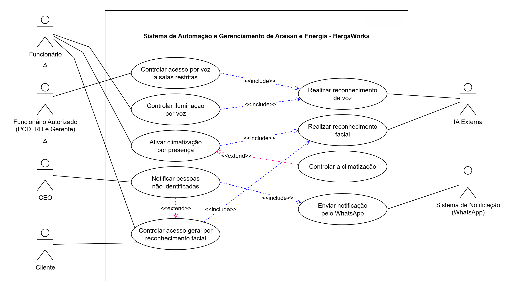
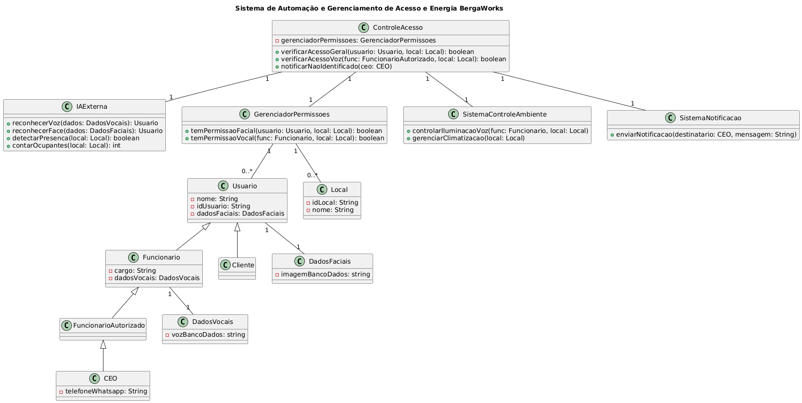

# BergaWorks | Controle de Acesso Inteligente

Documentação técnica e modelagem arquitetural para um sistema corporativo de segurança biométrica focado em conformidade legal (LGPD), automação e acessibilidade.

Projeto acadêmico avaliado com nota máxima (100/100) pelo rigor técnico na documentação.

---

## O problema

Ambientes corporativos modernos precisam integrar alta segurança (controle de áreas restritas) com eficiência energética (climatização e luzes inteligentes). O desafio é implementar inteligência artificial (reconhecimento facial e de voz) sem comprometer a acessibilidade e operando estritamente dentro das leis de proteção de dados.

## A solução

O planejamento de um sistema integrado de orquestração local com APIs de IA externa, definindo regras claras de operação:
- **Acesso Multicamadas:** Liberação de portas baseada em hierarquia corporativa via biometria facial e comandos de voz.
- **Automação de Infraestrutura:** Controle de iluminação e ar-condicionado ativado por presença, otimizando o consumo de energia.
- **Segurança e Privacidade:** Criptografia ponta a ponta (AES-256 e TLS 1.3) e adequação rigorosa à LGPD.

## Como foi feito

O ciclo completo de Engenharia de Sistemas, documentado do zero:
1. **Elicitação:** Transcrição detalhada de entrevistas com stakeholders para garantir 100% de precisão na extração dos requisitos.
2. **Engenharia de Requisitos:** Mapeamento de Requisitos Funcionais e Não Funcionais (definindo SLAs, latência máxima de 1 segundo para abertura de portas e certificações ANATEL/ABNT).
3. **Modelagem UML:** Construção de Diagramas de Casos de Uso e Diagramas de Classe para ilustrar a arquitetura estática e as interações do sistema.

## Modelagem de Arquitetura (UML)

Para traduzir os requisitos em especificações técnicas visuais, foram desenvolvidos diagramas estruturais e comportamentais.

### Diagrama de Casos de Uso
Ilustra as fronteiras do sistema e as interações dos diferentes atores com as automações do escritório.

### Diagrama de Classes
Representa a estrutura estática do sistema, definindo as entidades, atributos e os controladores biométricos.

## Tecnologias e Metodologias

- UML (Unified Modeling Language)
- Engenharia de Requisitos
- Segurança da Informação (AES-256, TLS 1.3)
- Conformidade Regulatória (LGPD)

## Decisões de Design e Acessibilidade

Para garantir total autonomia no ambiente de trabalho, o sistema foi projetado para fornecer feedback sonoro distinto (sucesso, falha, repetição) em menos de 2 segundos, garantindo acessibilidade plena para colaboradores com deficiência visual ou limitações motoras.
